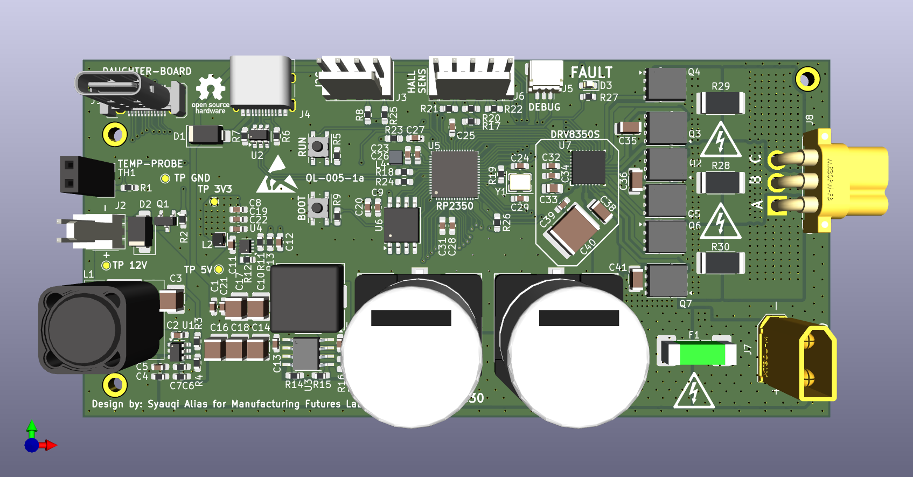
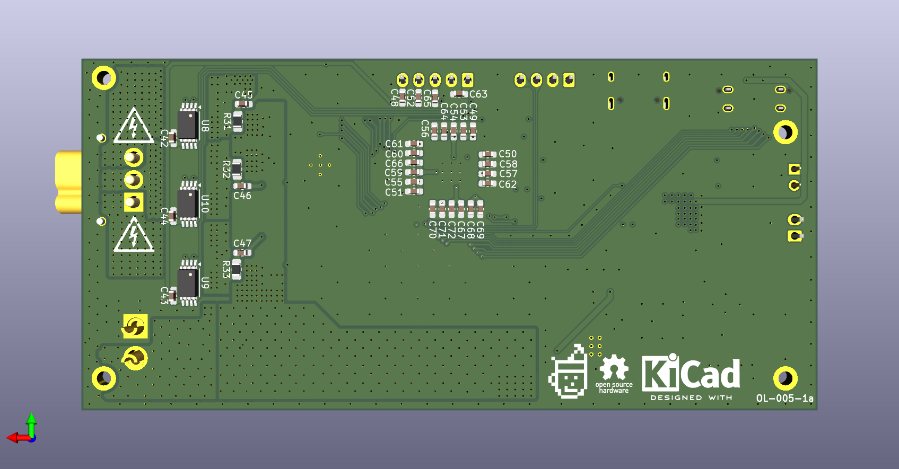

# Pico-BLDC-Controller

This project documents the design of a custom Brushless DC (BLDC) motor controller for a hotplate magnetic stirrer, intended for integration with an Opentrons automated liquid handling robot at the Manufacturing Future Lab, University College London.

---

## Project Overview

The primary goal is to create an open-source, accessible, and robust controller for a **260W 30V/7A Maxon BLDC motor**. This is my first venture into designing a motor controller, especially one involving a three-phase half-bridge topology. The journey is as much about learning as it is about the final product.

---

## Hardware Design

The schematic design is functionally complete and is currently undergoing peer review. The component selection process prioritized simplicity and a reduced component count to make the design easier to understand and replicate.

### Key Components:

* **Microcontroller:** **Raspberry Pi RP2350**
    * Chosen for its straightforward development environment and strong community support. While the ADC conversion speed can be a limitation for high-performance Field-Oriented Control (FOC), the goal is to create a baseline design that the open-source community can build upon and optimize.

* **Pre-driver:** **Texas Instruments DRV8350S**
    * This integrated gate driver significantly simplifies the design by handling much of the complexity associated with driving MOSFETs, such as the need for external charge pumps or bootstrap components. It reduces the overall component count and circuit complexity.

* **Motor:** **Maxon EC 90 flat Ø90 mm, brushless, 260 W, with Hall sensors**
    * A powerful 260W brushless motor, providing more than enough torque for stirring viscous solutions.

---

## Software and Firmware

The initial firmware will be developed using the **[simpleFOC](https://simplefoc.com/)** library to accelerate development and establish a functional baseline.

Once the hardware is validated, a longer-term goal is to develop custom firmware from scratch to fully optimize the controller's performance for this specific application.

---

## Current Status

**Status:** In Development (Last Updated: 29/08/2025)

* [x] Component selection finalized.
* [x] Initial schematic design complete.
* [x] Schematic peer review in progress.
* [x] PCB layout design.
* [X] PCB peer review 
* [X] Send out PCB to manufacturer
* [ ] Prototyping and hardware testing.
* [ ] Firmware development.

I'm actively seeking feedback on the schematic from colleagues and online forums. The design has evolved significantly through this iterative process, and I'll continue to post updates as the project progresses.